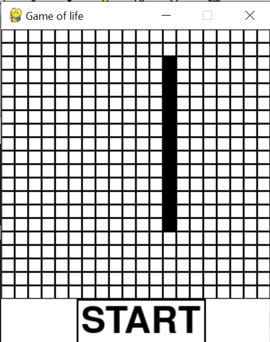

<h1>Conway's Game of Life in Pygame and Numpy </h1>

<h2>Description</h2>

This is an implementation of Conway's Game of Life. The program lets a user choose the number of vertical cells, number of horizontal cells and size of a cell.

   

After choosing the parameters, the program lets the user set the initial state of the grid by clicking on cells.

 

  

After clicking the start button on the previous menu, the game starts and new generations of the grid are generated at the default rate of 4 times per second. 

 
  

<h2>Installation</h2>

To install this implementation of the Game of Life you simply need to clone the repository with  
<code>git clone https://github.com/aleksanderdukaczewski/game-of-life</code>  
 
Download the required libraries with  
<code>pip install -r requirements.txt</code>  

 

<h2>Run the game</h2>

Run the game with  
<code>python main.py</code> 
 
If the command doesn't work try using 
<code>python3 main.py</code> 

